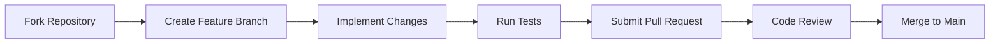

# Contribution Guidelines

## Development Workflow

## Forensic Module Standards

1. **Evidence Handling**
   - Maintain chain of custody in metadata
   - Preserve original evidence integrity

2. **Threat Analysis**
   - Map to MITRE ATT&CK framework
   - Include confidence scoring

3. **Reporting**
   - Use court-admissible formats (PDF, LaTeX)
   - Include methodology documentation

## Testing Requirements

- 90%+ code coverage
- Historical case validation
- Performance benchmarking

## Review Process

1. Security audit of new code
2. Forensic methodology validation
3. Performance impact analysis
4. Documentation update verification
