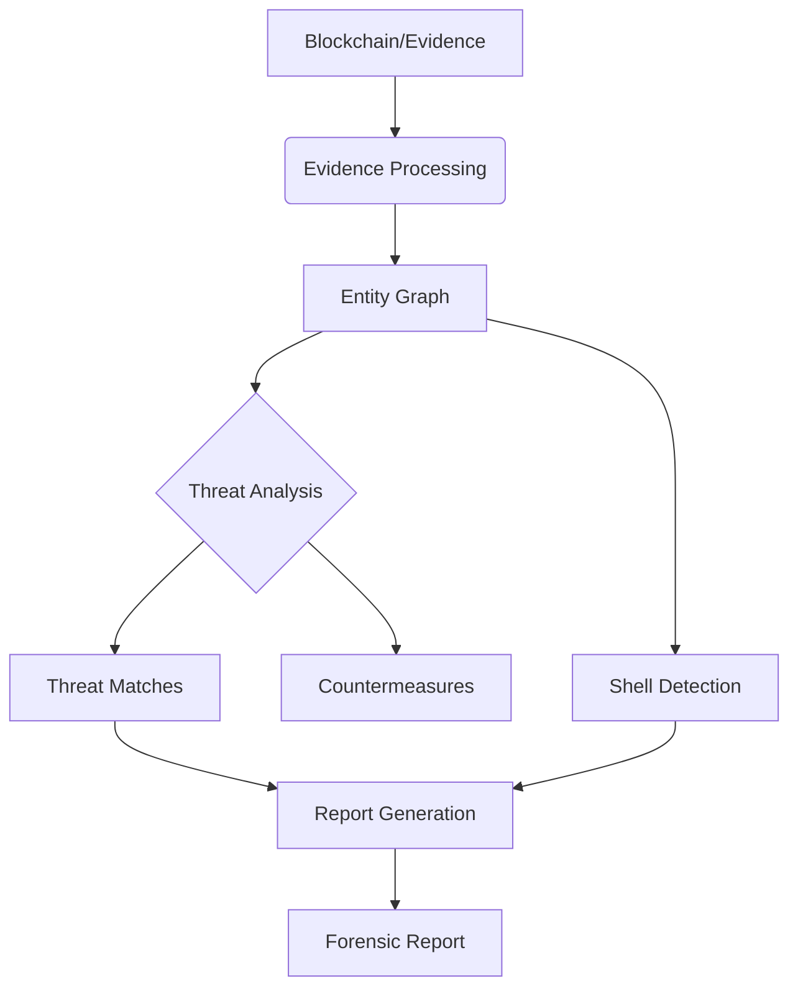

# Project Vajra — Technical Documentation

## Overview

Project Vajra is an AI-powered forensic automation system designed to:

- Accelerate financial crime investigations
- Automate evidence processing and threat analysis
- Generate structured forensic reports
- Orchestrate incident response workflows

## System Architecture



## Core Modules

### 1. Evidence Processing Engine (`EvidenceCorrelator`)

- **Input**: Raw evidence (blockchain transactions, device images)
- **Processing**: Entity resolution, bidirectional graph construction
- **Output**: Correlated entity graph
- **Key Methods**:
  - `link_evidence()` — Build entity graph from evidence items
  - `identify_shell_companies()` — Cluster transaction type patterns

### 2. Threat Intelligence Module (`PatternAnalyzer`)

- **Techniques**: Pattern matching against known threat actor profiles
- **Database**: 6 threat groups with MITRE ATT&CK IDs (Lazarus Group, APT29, FIN7, Scattered Spider, BlueNoroff, DarkSide)
- **Output**: Threat actor matches with confidence scores
- **Key Methods**:
  - `predict_threats(entity_graph)` — Match behaviors to threat database
  - `predict_next_targets(wallet_cluster)` — Identify high-risk wallets

### 3. Report Generation (`ReportAutomator`)

- **Workflows**:
  - `generate(insights)` — Create structured forensic documentation

### 4. Data Ingestion Pipeline (`EvidenceBuilder`)

Transforms raw blockchain API responses into the evidence format expected by `VajraSystem`:

```text
BlockchairAdapter.get_address_info(address)
        │
        ▼
EvidenceBuilder.build_evidence_item(address)
├── _infer_transaction_types()     → type_txhash list
├── _classify_behavior()           → behavioral tags
└── _calculate_risk_score()        → 0-100 risk score
        │
        ▼
Evidence dict → VajraSystem(case_data)
```

- **Key Methods**:
  - `build_case(case_id, wallet_addresses)` — Build full case from addresses
  - `build_evidence_item(address)` — Build single evidence item from API data

### 5. Blockchain API (`BlockchairAdapter`)

Free Blockchair API integration (no API key required for testing):

- `get_address_info(address, chain)` — Fetch address balance, tx count, volume
- `check_ofac_address(address)` — Query with OFAC sanction context

### 6. REST API (`vajra_api.py`)

- **Endpoints**:
  - `GET /health` — Health check
  - `POST /api/v1/cases/analyze` — Full pipeline analysis
  - `POST /api/v1/cases/correlate` — Evidence correlation only
  - `POST /api/v1/cases/threats` — Threat detection only
- **Interactive Docs**: Available at `/docs` when server is running

## Tool Reference

### `VajraSystem(case_data)`

```python
"""
Main orchestration class for forensic automation.

Parameters:
    case_data: Dict containing 'case_id' (str) and 'evidence' (list)

Methods:
    solve_case() -> str: Full processing pipeline, returns report

Raises:
    ValueError: If case_data is missing required fields

Attributes (after solve_case):
    _last_processing_time: float
    _last_entity_graph: dict
    _last_threat_matches: list
"""
```

### `EvidenceBuilder(adapter=None)`

```python
"""
Ingestion pipeline: raw blockchain API → VajraSystem evidence format.

Parameters:
    adapter: Optional BlockchairAdapter instance (created lazily if None)

Methods:
    build_case(case_id, wallet_addresses, chain, title) -> dict
    build_evidence_item(address, chain) -> dict
"""
```

### `BlockchairAdapter(api_key=None)`

```python
"""
Free blockchain API integration (no key for testing, key for production).

Methods:
    get_address_info(address, chain) -> dict
    check_ofac_address(address) -> dict

Raises:
    ConnectionError: If API request fails or returns error
"""
```

## Getting Started

```bash
# Install dependencies
pip install -r project_vajra/requirements.txt

# Configure environment
cp .env.example .env

# Run test suite
pytest tests/

# Process sample cases
python demo.py

# Process with live blockchain data
python demo.py --live

# Start API server
python -m project_vajra.vajra_api
```

## Deployment

```bash
docker compose -f deployment/docker-compose.yml up --build
```

## Resources

- `technical_appendix/`: Architecture deep-dives and module specifications
- `DEBUG.md`: Troubleshooting guide
- `tests/`: 30 validation tests
- API docs at `http://localhost:8000/docs` (when running)
