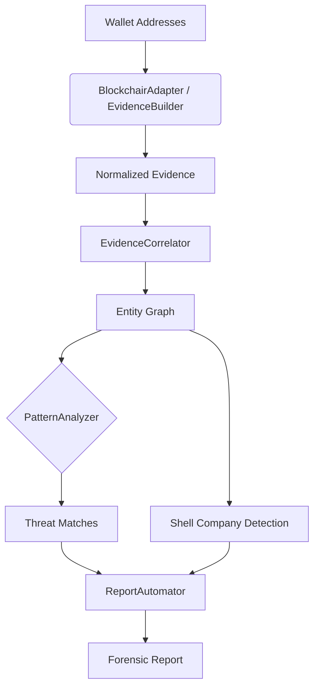

# Project Vajra

> AI-Powered Forensic Automation for Blockchain Investigation

[](https://www.python.org/)
[](LICENSE)
[](tests/)

## What It Does

Project Vajra automates the forensic analysis pipeline for cryptocurrency-related financial crime. Given a set of wallet addresses and transaction data, it:

1. **Correlates evidence** — Builds a bidirectional entity graph mapping wallet relationships
2. **Detects shell companies** — Clusters wallets by transaction type patterns to identify layering networks
3. **Matches threat actors** — Compares behavioral patterns against known APT profiles (Lazarus Group, APT29, FIN7, BlueNoroff, etc.) with MITRE ATT&CK IDs
4. **Generates reports** — Produces structured forensic reports with threat matches, shell clusters, and risk scores

## Quick Start

```bash
# Install dependencies
pip install -r project_vajra/requirements.txt

# Run the demo (processes 3 real-world-based cases)
python demo.py

# Run with live Blockchair API data (no key needed)
python demo.py --live

# Run test suite
pytest tests/
```

## Architecture



### Data Flow

```text
Raw blockchain API ──► BlockchairAdapter.get_address_info()
                           │
                           ▼
                    EvidenceBuilder.build_case()
                    ├── _infer_transaction_types()
                    ├── _classify_behavior()
                    └── _calculate_risk_score()
                           │
                           ▼
                    VajraSystem.solve_case()
                    ├── EvidenceCorrelator.link_evidence()
                    ├── EvidenceCorrelator.identify_shell_companies()
                    ├── PatternAnalyzer.predict_threats()
                    └── ReportAutomator.generate()
```

## Core Modules

| Module | Class | Purpose |
| --- | --- | --- |
| `core.py` | `VajraSystem` | Orchestrates the full analysis pipeline |
| `core.py` | `EvidenceCorrelator` | Builds bidirectional entity graph from evidence |
| `core.py` | `PatternAnalyzer` | Matches behaviors to 6 threat actor profiles |
| `core.py` | `ReportAutomator` | Generates structured forensic reports |
| `data_adapters.py` | `BlockchairAdapter` | Free Blockchair API integration (no key needed) |
| `data_adapters.py` | `EvidenceBuilder` | Transforms raw API data → VajraSystem evidence format |
| `data_adapters.py` | `BlockchainDataAdapter` | Generic blockchain API adapter (key required) |
| `data_adapters.py` | `ErrorHandler` | Structured JSON-lines error logging |
| `vajra_api.py` | FastAPI app | REST endpoints for case analysis |
| `vajra_tasks.py` | Celery tasks | Async background processing |

## Sample Data

The `sample_data/cases.py` module contains 3 cases based on real public sources:

| Case | Based On | Addresses |
| --- | --- | --- |
| Ronin Bridge Hack | OFAC SDN List + FBI Attribution | 7 real OFAC-designated Lazarus Group wallets |
| DeFi Flash Loan Exploit | Chainalysis 2024 Crypto Crime Report | Real Tornado Cash contract + synthetic wallets |
| Insider Front-Running | Synthetic scenario | Entirely synthetic addresses |

All Ronin Bridge wallet addresses are from public U.S. Treasury OFAC designations. Transaction IDs use Vajra's normalized `type_txhash` format with full-length 66-character Ethereum hashes.

## API

```bash
# Start the API server
python -m project_vajra.vajra_api

# Endpoints (interactive docs at /docs)
GET  /health                    # Health check
POST /api/v1/cases/analyze      # Full pipeline analysis
POST /api/v1/cases/correlate    # Evidence correlation only
POST /api/v1/cases/threats      # Threat detection only
```

## Docker Deployment

```bash
cp .env.example .env
docker compose -f deployment/docker-compose.yml up --build
```

Services:

- **API**: `http://localhost:8000` (with interactive docs at `/docs`)
- **Monitoring**: `http://localhost:3000` (Grafana)

## Project Structure

```text
project_vajra/          # Core Python package
├── core.py             # Evidence correlation, threat analysis, reporting
├── config.py           # Environment-based configuration
├── data_adapters.py    # Blockchain API + forensic format adapters
├── logging_config.py   # Production logging setup
├── vajra_api.py        # FastAPI REST endpoints
├── vajra_tasks.py      # Celery async task definitions
└── requirements.txt    # Python dependencies

sample_data/            # Realistic forensic cases (OFAC-sourced)
└── cases.py            # 3 cases: Ronin Bridge, DeFi exploit, insider trading

technical_appendix/     # Architecture deep-dives
├── vajra_architecture.md
├── antigravity_module.md
├── claude_threat_model.md
└── openclaw_orchestrator.md

tests/                  # 30 pytest tests + benchmarks
deployment/             # Docker configuration
demo.py                 # Run all sample cases
```

## Testing

```bash
pytest tests/ -v          # 30 tests, all passing
python tests/benchmark.py # Performance validation
```

## Contributing

See [CONTRIBUTING.md](CONTRIBUTING.md) for guidelines.

## License

MIT — see [LICENSE](LICENSE).
