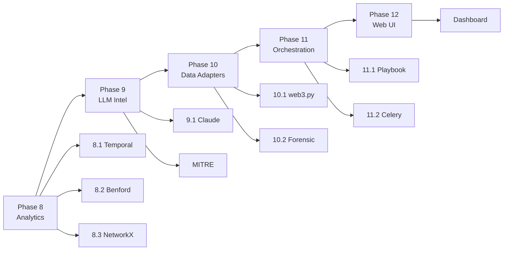

# Project Vajra - Full Implementation Plan

## Overview

This plan covers implementation of all remaining subsystems (Phases 8-12) to bridge the gap between the current MVP and the full architectural vision.

---

## Phase 8 — Advanced Analytics Integration

### 8.1 Temporal Analysis Engine

- [ ] Create `project_vajra/analytics/temporal.py` module
- [ ] Implement `EnhancedCorrelator` class extending `EvidenceCorrelator`
- [ ] Implement `analyze_crypto_transactions()` method for time-of-day clustering
- [ ] Implement `identify_money_laundering()` method with Benford's Law analysis
- [ ] Add `antigravity/forensics.py` import path alias
- [ ] Write tests for temporal clustering in `tests/test_analytics.py`

### 8.2 Benford's Law Checker

- [ ] Add statistical anomaly detection to `EnhancedCorrelator`
- [ ] Implement first-digit distribution analysis
- [ ] Add configurable deviation threshold (default 15%)
- [ ] Return structured anomaly reports with actual vs expected values
- [ ] Add to `core.py` pipeline integration

### 8.3 Graph Algorithms (NetworkX)

- [ ] Add `networkx` to `requirements.txt`
- [ ] Create `project_vajra/analytics/graph.py` module
- [ ] Implement `GraphProcessor` class to replace dictionary traversal in `core.py`
- [ ] Implement multi-hop shell network detection
- [ ] Add centrality calculations (degree, betweenness, eigenvector)
- [ ] Add network shell decomposition for ring detection
- [ ] Update `EvidenceCorrelator.link_evidence()` to use `GraphProcessor`
- [ ] Write tests for graph algorithms

---

## Phase 9 — LLM & Dynamic Threat Intel

### 9.1 Claude Model Integration

- [ ] Create `project_vajra/intelligence/claude_client.py` module
- [ ] Implement `ClaudeAnalyzer` class with pattern extraction from unstructured intel
- [ ] Add API integration for Claude model calls
- [ ] Implement `extract_threat_actors()` using NER for org/GPE entities
- [ ] Implement `predict_tactics()` mapping to MITRE ATT&CK framework
- [ ] Create `project_vajra/intelligence/threat_intel.py` module
- [ ] Implement `AdvancedAnalyzer` extending `PatternAnalyzer`
- [ ] Add dynamic threat profile updating from feed ingestion
- [ ] Write tests for threat intelligence pipeline

### 9.2 MITRE ATT&CK Enrichment

- [ ] Add `MITRE_MAPPING` dictionary to `AdvancedAnalyzer`
- [ ] Implement `enrich_threats()` method to add technique mappings
- [ ] Implement `generate_sigma_rule()` for SIEM detection rules
- [ ] Add Sigma rule generation to `PatternAnalyzer.predict_threats()` output
- [ ] Create `project_vajra/intelligence/sigma_generator.py` module
- [ ] Write tests for MITRE ATT&CK enrichment

---

## Phase 10 — Production Data Adapters

### 10.1 Chain-Native Integrations (web3.py)

- [ ] Add `web3.py` to `requirements.txt`
- [ ] Create `project_vajra/adapters/chain/ethereum.py` module
- [ ] Implement `EthereumAdapter` class with direct RPC node querying
- [ ] Implement smart contract log parsing (ERC-20 transfers, Tornado Cash)
- [ ] Create `project_vajra/adapters/chain/polygon.py` module
- [ ] Implement `PolygonAdapter` for PoS chain analysis
- [ ] Update `BlockchainDataAdapter` to use chain-specific adapters
- [ ] Add transaction trace analysis for multi-hop detection
- [ ] Write integration tests for chain adapters

### 10.2 Forensic Evidence Stubs

- [ ] Create `project_vajra/adapters/forensics/axiom_parser.py` module
- [ ] Implement `AxiomParser` class with HTML report parsing
- [ ] Implement `convert_axiom()` in `ForensicEvidenceAdapter`
- [ ] Create `project_vajra/adapters/forensics/ftk_parser.py` module
- [ ] Implement `FTKParser` class for disk image parsing
- [ ] Implement `convert_ftk()` using pytsk3 for filesystem extraction
- [ ] Add `pytsk3` conditional import handling for Windows dev environments
- [ ] Update `ForensicEvidenceAdapter` interface contract
- [ ] Write tests for forensic adapters (mock-based)

---

## Phase 11 — Orchestration & Countermeasures

### 11.1 OpenClaw Playbook Generator

- [ ] Create `project_vajra/orchestration/playbook_generator.py` module
- [ ] Implement `PlaybookGenerator` class
- [ ] Implement YAML playbook generation from threat matches
- [ ] Implement `generate_crypto_fraud_response()` method per spec
- [ ] Create `project_vajra/orchestration/openclaw.py` module
- [ ] Implement `OpenClawClient` for playbook execution
- [ ] Add CI/CD pipeline validation steps
- [ ] Write tests for playbook generation

### 11.2 Celery Task Expansion

- [ ] Create `project_vajra/tasks/async_tasks.py` module
- [ ] Implement `process_large_graph` task for async graph correlation
- [ ] Implement `enrich_threat_intel` task for LLM analysis
- [ ] Implement `generate_report` task for async report creation
- [ ] Add Redis connection pooling configuration
- [ ] Update `vajra_tasks.py` with task retry policies
- [ ] Add task chaining for multi-stage pipelines
- [ ] Write tests for async task workflows

---

## Phase 12 — Web Interface

### 12.1 Dashboard

- [ ] Create `dashboard/` directory structure
- [ ] Initialize Next.js project with TypeScript
- [ ] Set up FastAPI proxy for `/api/vajra/*` endpoints
- [ ] Implement entity graph visualization component
- [ ] Implement threat metrics dashboard
- [ ] Add report viewer component
- [ ] Implement wallet address search
- [ ] Add real-time update via WebSocket or polling
- [ ] Write frontend tests with Playwright

---

## Implementation Order



---

## File Structure After Implementation

```
project_vajra/
├── __init__.py
├── config.py
├── core.py
├── data_adapters.py
├── logging_config.py
├── requirements.txt
├── vajra_api.py
├── vajra_tasks.py
├── analytics/
│   ├── __init__.py
│   ├── temporal.py       # EnhancedCorrelator, Benford's Law
│   └── graph.py          # GraphProcessor, NetworkX integration
├── intelligence/
│   ├── __init__.py
│   ├── claude_client.py # ClaudeAnalyzer
│   ├── threat_intel.py   # AdvancedAnalyzer
│   └── sigma_generator.py
├── adapters/
│   ├── __init__.py
│   ├── chain/
│   │   ├── __init__.py
│   │   ├── ethereum.py   # EthereumAdapter (web3.py)
│   │   └── polygon.py    # PolygonAdapter
│   └── forensics/
│       ├── __init__.py
│       ├── axiom_parser.py
│       └── ftk_parser.py
├── orchestration/
│   ├── __init__.py
│   ├── playbook_generator.py
│   └── openclaw.py
├── tasks/
│   ├── __init__.py
│   └── async_tasks.py
dashboard/                 # Next.js frontend
├── package.json
├── src/
│   ├── app/
│   ├── components/
│   └── lib/
└── tests/
    ├── test_analytics.py
    ├── test_intelligence.py
    ├── test_adapters.py
    └── test_orchestration.py
```

---

## Dependencies to Add

```
# requirements.txt additions
networkx>=3.2.1
web3.py>=6.15.0
anthropic>=0.18.0
celery[redis]>=5.3.0
redis>=5.0.0
pytsk3>=20210419; sys_platform == "linux"
```

---

## Integration Points

1. **Analytics → Core**: `EvidenceCorrelator` extends `EnhancedCorrelator`
2. **Intelligence → Core**: `PatternAnalyzer` extends `AdvancedAnalyzer`
3. **Adapters → EvidenceBuilder**: Chain adapters replace generic REST calls
4. **Orchestration → All**: Playbook generator consumes threat matches and graph data
5. **Tasks → All**: Celery tasks wrap long-running operations from all phases
6. **Dashboard → All**: Visualizes outputs from all subsystems
