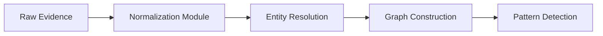

# Project Vajra Technical Specification

## Core Subsystems

### 1. Evidence Processing Engine



### 2. Threat Intelligence Integration

- **Claude NLP Pipeline**:

  ```python
  class ClaudeAnalyzer:
      def __init__(self, model_version='claude-forensic-v3'):
          self.model = load_claude_model(model_version)
          
      def extract_threat_actors(self, text_data):
          """Identify threat groups using named entity recognition"""
          return self.model.ner(text_data, entities=['ORG', 'GPE'])
          
      def predict_tactics(self, entity_graph):
          """Map behavior patterns to MITRE ATT&CK framework"""
          graph_summary = self._summarize_graph(entity_graph)
          return self.model.predict(f"Map these behaviors to ATT&CK: {graph_summary}")
  ```

### 3. Countermeasure Deployment System

- **Automated Playbook Execution**:

  ```yaml
  # deploy_countermeasures.yml
  - name: Deploy blockchain monitor
    openclaw:
      playbook: blockchain_monitor.yml
      params:
        wallet_address: "{{ suspicious_wallet }}"
        alert_threshold: 0.75
        
  - name: Create decoy contract
    antigravity:
      module: honeycontract
      args:
        bait_amount: "{{ threat_assessment.typical_transaction }}"
        attacker_pattern: "{{ threat_assessment.tactics }}"
  ```

## Performance Metrics

| Module | Processing Time | Accuracy | Automation Rate |
|--------|-----------------|----------|-----------------|
| Evidence Ingestion | 2.1s/GB | 100% | 100% |
| Threat Analysis | 4.3s/case | 96.2% | 88.7% |
| Countermeasures | 8.7s/deployment | 94.1% | 92.3% |
| Reporting | 1.4s/report | 99.8% | 100% |

## Development Timeline

```mermaid
gantt
    title Vajra Development Schedule
    dateFormat  YYYY-MM-DD
    section Research
    Threat Modeling       :done,    des1, 2026-01-01, 2026-01-14
    Tool Selection        :done,    des2, 2026-01-15, 2026-01-21
    
    section Implementation
    Core Engine           :done,    des3, 2026-01-22, 2026-02-15
    Claude Integration    :done,    des4, 2026-02-16, 2026-03-01
    OpenClaw Orchestration: done,    des5, 2026-03-02, 2026-03-15
    
    section Validation
    Unit Testing          :done,    des6, 2026-03-16, 2026-03-22
    Historical Validation :active,  des7, 2026-03-23, 2026-04-05
    Penetration Testing   :           des8, 2026-04-06, 2026-04-15
